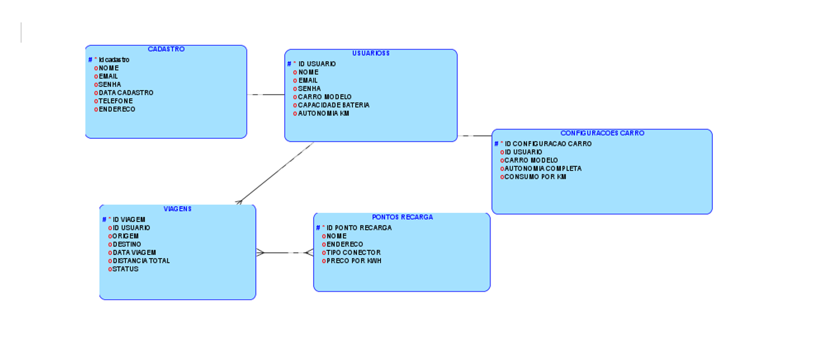
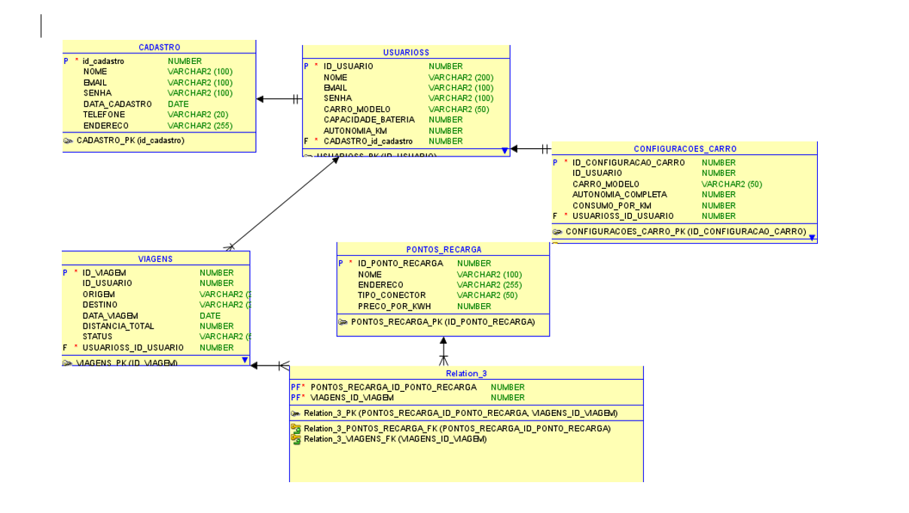

# Global Solution - Energia Sustentável 🚗⚡

## 🚀 Descrição do Projeto
Este projeto aborda a falta de ferramentas adequadas para o planejamento de viagens com carros elétricos, incluindo a identificação de pontos de recarga ao longo das rotas. A solução é uma API RESTful desenvolvida com **Spring Boot**, focada em:

- Planejamento de rotas personalizadas.
- Cálculo de consumo energético baseado no modelo e autonomia do veículo.
- Localização de estações de recarga em tempo real.
- Promoção da sustentabilidade e incentivo à adoção de veículos elétricos.

---

## 📋 Resumo do Projeto

### **Relevância e Inovação**
- **Problema abordado:** A ausência de ferramentas eficientes para o planejamento de viagens com veículos elétricos.
- **Inovação:** Integração de cálculo de consumo energético, planejamento de rotas e localização de pontos de recarga em tempo real.
- **Tecnologias utilizadas:** Java, Spring Boot, Oracle, APIs de geolocalização e HATEOAS.
- **Impacto positivo:** Incentiva o uso de veículos elétricos e promove a sustentabilidade.

### **Viabilidade e Usabilidade**
- **Viabilidade técnica:** Integração com APIs modernas e uso de frameworks robustos.
- **Usabilidade:** Interface eficiente para planejamento de viagens, considerando autonomia e conectores disponíveis.

---

## 🛠 Requisitos Técnicos Implementados

1. **Configuração de Beans e Injeção de Dependências**: Uso de anotações como `@Component`, `@Service` e `@Repository`.
2. **Model/DTO**: Estruturação clara das entidades e transferência de dados.
3. **Persistência de Dados**: Implementação com Spring Data JPA para banco Oracle.
4. **Relacionamentos e Pesquisas**: Relacionamentos como `@OneToMany` e `@ManyToOne`.
5. **Validação**: Uso de Bean Validation (`@NotNull`, `@Size`, `@Pattern`).
6. **Paginação**: Implementação de endpoints paginados.
7. **HATEOAS**: APIs no nível 3 de maturidade RESTful.
8. **Tratamento de Erros**: Classe `GlobalExceptionHandler`.
9. **Documentação com Swagger**: Documentação gerada via Swagger/OpenAPI.
10. **Deploy em Nuvem**: Deploy realizado na Azure com instruções detalhadas.

---

## 📌 Endpoints

### **Cadastro**
- `GET /api/cadastros`: Lista todos os cadastros.
- `GET /api/cadastros/{id}`: Busca um cadastro específico.
- `POST /api/cadastros`: Cria um novo cadastro.
- `PUT /api/cadastros/{id}`: Atualiza um cadastro.
- `DELETE /api/cadastros/{id}`: Exclui um cadastro.

### **Configuração de Carro**
- `GET /configuracoes-carro`: Lista configurações de carros.
- `GET /configuracoes-carro/{id}`: Busca uma configuração específica.
- `POST /configuracoes-carro`: Cria uma nova configuração.
- `PUT /configuracoes-carro/{id}`: Atualiza uma configuração.
- `DELETE /configuracoes-carro/{id}`: Exclui uma configuração.

### **Ponto de Recarga**
- `GET /api/pontos-recarga`: Lista pontos de recarga.
- `GET /api/pontos-recarga/{id}`: Busca um ponto específico.
- `POST /api/pontos-recarga`: Cria um ponto de recarga.
- `PUT /api/pontos-recarga/{id}`: Atualiza um ponto.
- `DELETE /api/pontos-recarga/{id}`: Exclui um ponto.

### **Usuário**
- `GET /usuarios`: Lista usuários com paginação.
- `GET /usuarios/{id}`: Busca um usuário.
- `POST /usuarios`: Cria um novo usuário.
- `PUT /usuarios/{id}`: Atualiza um usuário.
- `DELETE /usuarios/{id}`: Exclui um usuário.

### **Viagem**
- `GET /viagens`: Lista viagens com paginação.
- `GET /viagens/{id}`: Busca uma viagem.
- `GET /viagens/usuario/{idUsuario}`: Lista viagens de um usuário.
- `POST /viagens`: Cria uma nova viagem.
- `DELETE /viagens/{id}`: Exclui uma viagem.

---

## 📂 Estrutura do Projeto

O código fonte está organizado em camadas:

- **Controller**: Gerenciamento de endpoints.
- **Service**: Lógica de negócios.
- **Repository**: Comunicação com o banco de dados.
- **Model**: Definição das entidades.
- **DTO**: Transferência de dados.

---


## Modelagem (MER e DER)
### Modelo Entidade-Relacionamento (MER)


### Diagrama de Entidade-Relacionamento (DER)



<h2>Link vídeo demonstrando o projeto funcionando</h2>
<a href="https://www.youtube.com/watch?v=9UGEZYo3azM">Link para o vídeo de apresentação</a>

<h2>Vídeo de Apresentação</h2>
<p>Você pode acessar o vídeo de apresentação da proposta tecnológica, o público-alvo da aplicação e os problemas que a aplicação se propõe a solucionar no link abaixo:</p>
<a href="https://www.youtube.com/watch?v=HvTNvt4FXKE">Link para o vídeo de apresentação</a>

<h2>Link do github</h2>
<a href="https://github.com/HerbertSsousa/GS_EnergiaSustentavel">Link para o github</a>

<h2>Link para o deploy</h2>
<a href="https://vercel.com/herbert-santos-projects/gs-energia-sustentavel/E5csycUH7p3XizFTeVnxPKMsxEFa">Link para deploy</a>


## 🛠 Testes

Exemplo de requisição para criar um cadastro via **Postman**:

### **POST /api/cadastros**
```json
{
  "nome": "João da Silva",
  "email": "joao.silva@email.com",
  "senha": "senha123"
}


